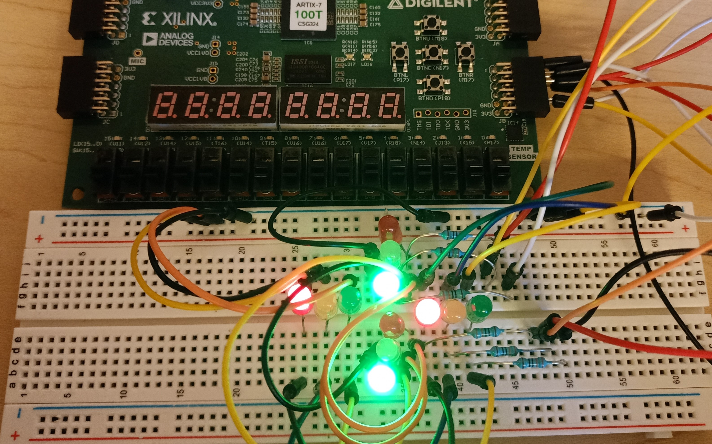
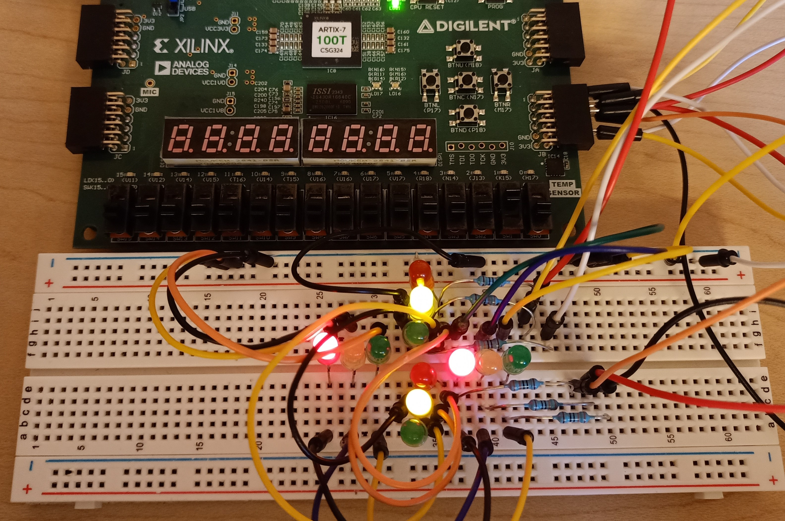

# Traffic Light Controller (4-way intersection)

- **Institution:** University of Kansas
- **Course:** EECS 443 (Digital Systems Design)

A VHDL implementation of a traffic light system for a 4-way intersection, targeting the Nexys4 field-programmable gate array (FPGA) board.

<table>
  <tr>
    <td align="center">
       
      <em>Figure 1: Traffic lights (green North-South, yellow East-West).</em>
    </td>
    <td align="center">
       
      <em>Figure 2: Traffic lights (yellow North-South, red East-West).</em>
    </td>
</table>

# Deployment instructions

In the [Vivado 2025.2 suite](https://www.amd.com/en/products/software/adaptive-socs-and-fpgas/vivado.html), import the project and compile it. Using a

# How it works

Download the final report for this project [here](docs/files/EECS443_Final_Project_Report.pdf).
