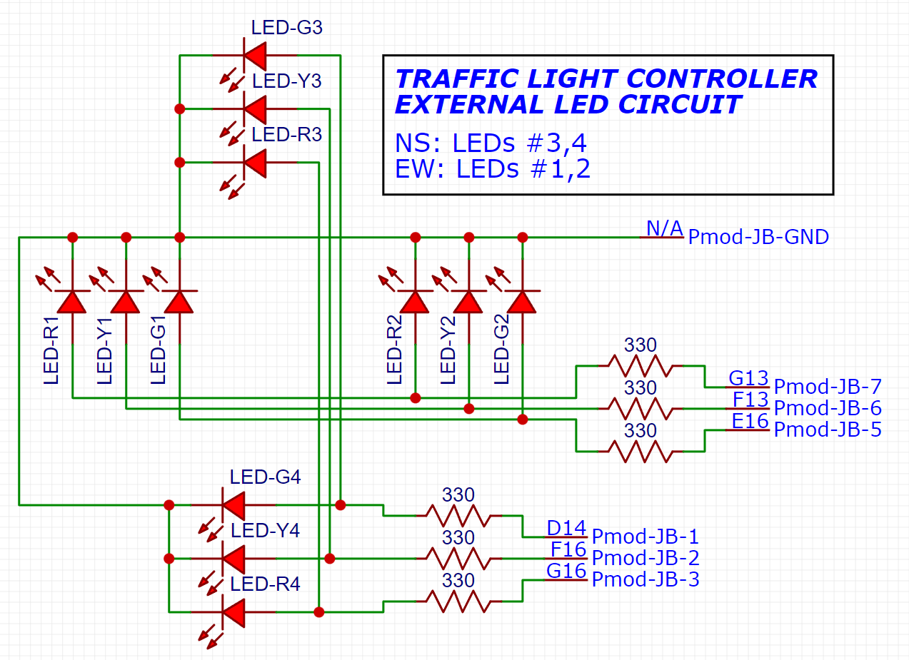
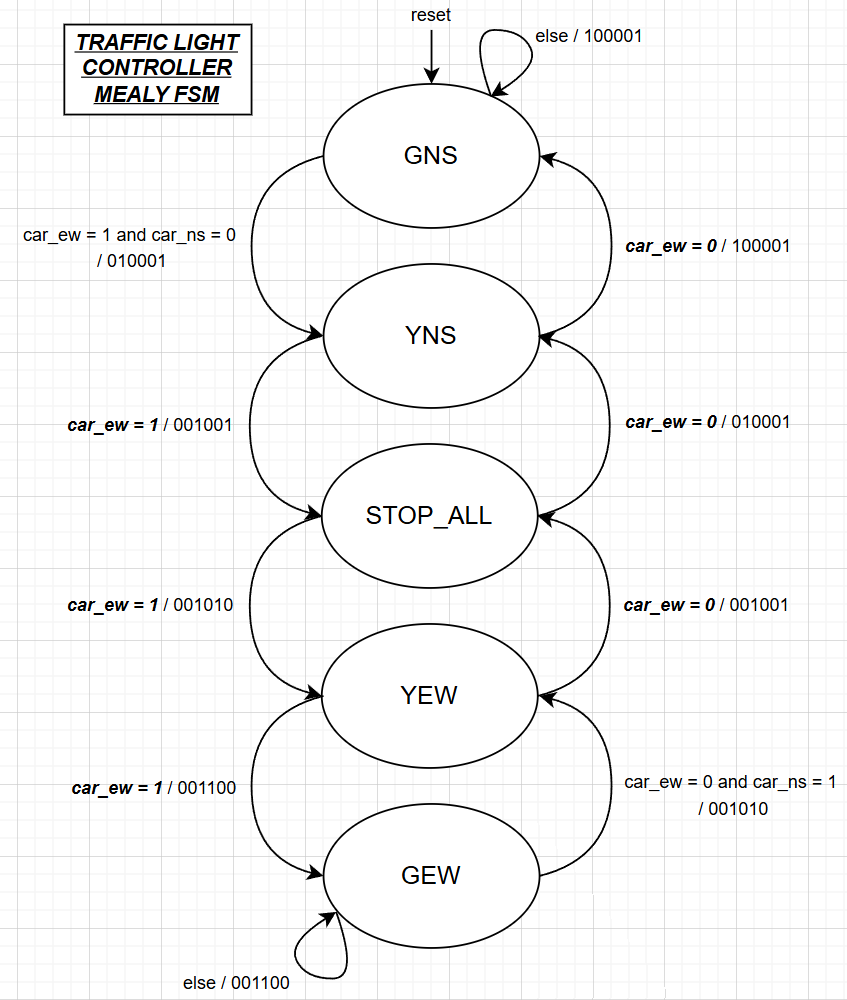

# Traffic Light Controller

- **Institution:** University of Kansas
- **Course:** EECS 443 (Digital Systems Design)

A simple VHDL implementation of a traffic light system for a 4-way intersection, targeting the Nexys A7 field-programmable gate array (FPGA) board. A simple Mealy finite state machine (FSM) determines the current state of the intersection based on the provided on-board switch inputs. External LED circuitry was added to visually showcase the state of the traffic light controller. See images below for reference:

<table>
  <tr>
    <td align="center">
       
      <em>Figure 1: Traffic lights (green N-S, yellow E-W).</em>
    </td>
    <td align="center">
       
      <em>Figure 2: Traffic lights (yellow N-S, red E-W).</em>
    </td>
</table>

# Deployment instructions

<figure align="center">
   
  <figcaption><em>Figure 3: External LED circuit diagram for the traffic light controller.</em></figcaption>
</figure>
  

In the [Vivado 2025.2 suite](https://www.amd.com/en/products/software/adaptive-socs-and-fpgas/vivado.html), import the project and then upload it to the Nexys A7 board. Follow the provided diagram to assemble the external circuitry.

# How it works

<figure align="center">
   
  <figcaption><em>Figure 4: Mealy FSM for the traffic light controller.</em></figcaption>
</figure>
  

Download the final report for this project [here](docs/files/EECS443_Final_Project_Report.pdf).
